# 🧠 AI Chat Portal

An end-to-end conversational AI platform built with React (TypeScript) and Django (REST API + PostgreSQL).
It allows users to chat with an AI assistant (powered by Llama 3.2 3B Instruct via LM Studio), view saved conversations, generate summaries, and query conversation insights — all in a clean ChatGPT-style interface.

🚀 Features

✅ Real-time chat with AI (streamed via LM Studio’s /v1/chat/completions endpoint)
✅ Persistent conversations stored in PostgreSQL
✅ Automatic and manual conversation summarization
✅ Insights page – ask intelligent questions about past conversations
✅ Fully responsive ChatGPT-like UI 
✅ Search, rename, and delete chat history
✅ Cyclic popup reminders for summarization every few messages

## 🖼️ Screenshots

### 💬 Chat Interface  

---

### 🧾 Summary View  

---

### 🔍 Insights Page  

---

### 🧠 Search UI  

---

### ⚙️ End Summary Popup  

---

### 🗑️ Delete Confirmation  

### DarkMode 

# ⚙️ Setup Instructions

🧩 1. Clone the repository

     git clone https://github.com/yourusername/ai-chat-portal.git
     cd ai-chat-portal

🐍 2. Backend Setup (Django + PostgreSQL)

Create a virtual environment    
 
     python3 -m venv venv
     
     source venv/bin/activate  # On Windows use: venv\Scripts\activate
     

Create .env file in the project root (next to manage.py)

     SECRET_KEY=your-secret-key
     DEBUG=True
     DATABASE_NAME=ai_chat_db
     DATABASE_USER=postgres
     DATABASE_PASSWORD=yourpassword
     DATABASE_HOST=localhost
     DATABASE_PORT=5432
     AI_BASE_URL=http://127.0.0.1:1234
     AI_MODEL=llama-3.2-3b-instruct

Apply migrations
     
     python manage.py migrate

Run the Django backend

     python manage.py runserver

Backend runs on http://127.0.0.1:8000

## ⚛️ 3. Frontend Setup (React + TypeScript)

     cd ai-chat-frontend
     npm install
     npm run dev

Frontend runs on http://localhost:5173     

## 🦙 4. LLM Setup (LM Studio)

Open LM Studio

Load and start the model:

     llama-3.2-3b-instruct

Start the local server (default port 1234):

     [LM STUDIO SERVER] -> POST http://127.0.0.1:1234/v1/chat/completions

## 📖 API Documentation ()

> This project uses Django REST Framework.  
> The following endpoints are available for managing conversations, messages, and insights.

| Endpoint | Method | Description | Request Body | Response Example |
|-----------|---------|--------------|---------------|------------------|
| `/api/conversations/` | `GET` | List all conversations | – | `[{"id":1,"title":"Chat 1","status":"active"}]` |
| `/api/conversations/` | `POST` | Create a new conversation | – | `{"id":2,"title":"New Chat","status":"active"}` |
| `/api/conversations/{id}/` | `GET` | Retrieve conversation details (messages + summary) | – | `{ "id":1,"title":"Chat 1","messages":[...],"summary":"..." }` |
| `/api/conversations/{id}/end/` | `POST` | End conversation and generate AI summary | – | `{ "summary": "This chat discussed..." }` |
| `/api/conversations/{id}/intelligence/` | `POST` | Ask questions about a saved conversation (LLM-powered) | `{ "question": "What was discussed about medicine?" }` | `{ "answer": "You discussed monthly purchase details..." }` |

> 💡 **Note:**  
> The AI summarization and insight generation routes use **LLaMA 3.2 (3B Instruct)** via **LLM Studio** integration.  
> Conversation and message data are stored in **PostgreSQL**.

## 💬 Sample Conversation and Insights

Example conversation flow:

     User: Hey, can you help me draft an email for a meeting follow-up?
     AI: Sure! Here’s a sample professional follow-up email template...
     User: Make it sound a bit friendlier.
     AI: Here's a revised version with a more conversational tone...

Generated Summary:

     The user asked for help drafting a friendly meeting follow-up email.
     The assistant provided a professional version and then rewrote it with a friendlier tone.

Sample Insight Query:

     Q: What was the main topic discussed in this conversation?
     A: The discussion focused on crafting a professional and friendly follow-up email template.

## 🧩 Architecture Diagram

### 🏗️ System Overview
Below is the high-level architecture showing the flow of data between the frontend, backend, AI model, and database.

```mermaid
flowchart TD
    subgraph Frontend["💻 React + TypeScript - AI Chat Portal"]
        A1["User Interface"] --> A2["Chat Messages"]
        A1 --> A3["Summary View"]
        A1 --> A4["Insights (LLM Q&A)"]
    end

    subgraph Backend["⚙️ Django REST Framework"]
        B1["Conversation API"] --> B2["Message API"]
        B1 --> B3["Summary Endpoint (/end)"]
        B1 --> B4["Intelligence Endpoint (/intelligence)"]
    end

    subgraph AI["🧠 LLaMA 3.2 - 3B Instruct (LLM Studio)"]
        C1["Generate Responses"]
        C2["Create Summaries"]
        C3["Answer Insight Queries"]
    end

    subgraph DB["🗄️ PostgreSQL Database"]
        D1["Conversations Table"]
        D2["Messages Table"]
        D3["Summaries / Metadata"]
    end

    Frontend -->|"Sends chat messages"| Backend
    Backend -->|"Stores & Retrieves data"| DB
    Backend -->|"Requests AI response"| AI
    AI -->|"Returns summary or insight"| Backend
    Backend -->|"Sends structured JSON data"| Frontend
```

## Data Flow:

     User sends message → React frontend → Django API
     
     Django stores message → forwards to LM Studio
     
     LM Studio responds → Django saves AI reply → frontend updates
     
     When chat ends → Django generates and stores summary
     
     User can query insights later (semantic question answering on stored text)     

## 📦 requirements.txt

     Django>=5.0
     djangorestframework>=3.15
     django-cors-headers>=4.0
     psycopg2-binary>=2.9
     python-dotenv>=1.0

| Package                 | Purpose                                                                              |
| ----------------------- | ------------------------------------------------------------------------------------ |
| **Django**              | Core web framework used to build your backend                                        |
| **djangorestframework** | REST API layer for endpoints like `/conversations/`                                  |
| **django-cors-headers** | Allows frontend (React) to access Django APIs                                        |
| **psycopg2-binary**     | PostgreSQL database driver for Django                                                |
| **python-dotenv**       | Loads environment variables from `.env` file (used for `SECRET_KEY`, DB credentials) |
| **requests**            | Allows Django backend to call external APIs (e.g., LLaMA API)                        |

